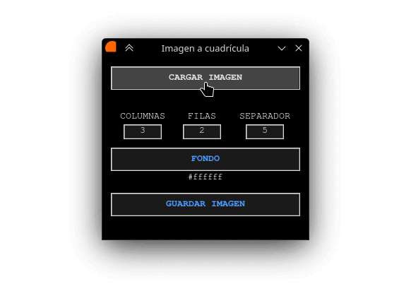

# ImGrid

A tool for generating print-ready image grids. It distributes an image across multiple rows and columns, allows configuring the spacing between copies, and lets you choose the background color of the final composition. Available both as a graphical interface (GUI) and as a command-line tool (CLI).



---

## Installation on Debian (APT)

1. Add the APT repository:
   ```bash
   sudo echo "deb https://pablinet.github.io/apt ./" > /etc/apt/sources.list.d/pablinet.list
   ```

2. Add the APT key:

   With `curl`:
   ```bash
   sudo curl -fsSL https://pablinet.github.io/apt/pablinet.gpg -o /etc/apt/trusted.gpg.d/pablinet.gpg
   ```

   Or with `wget`:
   ```bash
   sudo wget -O /etc/apt/trusted.gpg.d/pablinet.gpg https://pablinet.github.io/apt/pablinet.gpg
   ```

3. Update:
   ```bash
   sudo apt update
   ```

4. Install:

   GUI version (GTK4):
   ```bash
   sudo apt install gtkimgrid
   ```

   GUI version (Tkinter):
   ```bash
   sudo apt install tkimgrid
   ```

   GUI version (Qt6):
   ```bash
   sudo apt install qtimgrid
   ```

   CLI version:
   ```bash
   sudo apt install imgrid
   ```

## Download

Available at [www.pabli.net.ar/descargas](https://www.pabli.net.ar/descargas).

## Requirements

- [pyimgrid](https://pypi.org/project/pyimgrid/) (`python3-pyimgrid`)
- [Pillow](https://python-pillow.org/) (`python3-pil`)

```bash
pip install pyimgrid pillow
```

### GUI dependencies (Debian APT)

Depending on the GUI version you want to use:

**GTK4** (`gtkimgrid`):
```bash
sudo apt install gir1.2-gdkpixbuf-2.0 gir1.2-gtk-4.0 python3 python3-gi python3-pil
```

**Tkinter** (`tkimgrid`) — also requires [CairoSVG](https://cairosvg.org/):
```bash
sudo apt install python3-cairosvg python3-pil.imagetk python3-tk
```

**Qt6** (`qtimgrid`):

```
./imgrid <input> <config> [output]
```

### Arguments

| Argument  | Required | Description |
|-----------|----------|-------------|
| `input`   | Yes | Path to the source image |
| `config`  | Yes | Grid configuration (see below) |
| `output`  | No  | Path for the output image (auto-generated if omitted) |

### Configuration

The `config` argument accepts up to three values separated by commas:

| Value | Required | Description |
|-------|----------|-------------|
| Grid  | Yes | Grid dimensions as `COLUMNSxROWS` — separator can be `x`, `X`, or `×` |
| Spacing | No | Gap between tiles in pixels |
| Background | No | Background color in hex format (e.g. `#000000` for black, `#FFFFFF` for white) |

## Examples

```bash
# 2 columns × 3 rows, save to output.jpg
./imgrid input.jpg 2x3 output.jpg

# 4 columns × 2 rows with 10px spacing
./imgrid input.jpg 4X2,10 output.jpg

# 3×3 grid with 5px spacing and black background
# Linux/macOS:
./imgrid input.jpg 3×3,5,\#000000 output.jpg
# Windows CMD:
imgrid input.jpg 3×3,5,#000000 output.jpg
# Windows PowerShell:
imgrid input.jpg 3×3,5,`#000000 output.jpg

# Auto-generated output filename
./imgrid input.jpg 2x3
```

## GUI

A graphical interface is available via Tkinter. Run it with:

```bash
./tkimgrid
```

> **Debian users:** Tkinter is not bundled with Python and must be installed separately:
> ```bash
> sudo apt install python3-tkinter
> ```

## License

This project is licensed under the [GNU General Public License v3.0](LICENSE).

---

# ImGrid

Es una herramienta para generar cuadrículas de imágenes listas para imprimir. Permite distribuir una imagen en múltiples filas y columnas, configurar el espaciado entre las copias y elegir el color de fondo de la composición final. Está disponible tanto como aplicación de interfaz gráfica (GUI) como para línea de comandos (CLI).


## Instalación en Debian (APT)

1. Agregar el repositorio APT:
   ```bash
   sudo echo "deb https://pablinet.github.io/apt ./" > /etc/apt/sources.list.d/pablinet.list
   ```

2. Agregar la clave APT:

   Con `curl`:
   ```bash
   sudo curl -fsSL https://pablinet.github.io/apt/pablinet.gpg -o /etc/apt/trusted.gpg.d/pablinet.gpg
   ```

   O con `wget`:
   ```bash
   sudo wget -O /etc/apt/trusted.gpg.d/pablinet.gpg https://pablinet.github.io/apt/pablinet.gpg
   ```

3. Actualizar:
   ```bash
   sudo apt update
   ```

4. Instalar:

   Versión GUI (GTK4):
   ```bash
   sudo apt install gtkimgrid
   ```

   Versión GUI (Tkinter):
   ```bash
   sudo apt install tkimgrid
   ```

   Versión GUI (Qt6):
   ```bash
   sudo apt install qtimgrid
   ```

   Versión CLI:
   ```bash
   sudo apt install imgrid
   ```

## Descarga

Disponible en [www.pabli.net.ar/descargas](https://www.pabli.net.ar/descargas).

## Requisitos

- [pyimgrid](https://pypi.org/project/pyimgrid/) (`python3-pyimgrid`)
- [Pillow](https://python-pillow.org/) (`python3-pil`)

```bash
pip install pyimgrid pillow
```

### Dependencias de la interfaz gráfica (Debian APT)

Según la versión de GUI que se quiera usar:

**GTK4** (`gtkimgrid`):
```bash
sudo apt install gir1.2-gdkpixbuf-2.0 gir1.2-gtk-4.0 python3 python3-gi python3-pil
```

**Tkinter** (`tkimgrid`) — requiere también [CairoSVG](https://cairosvg.org/):
```bash
sudo apt install python3-cairosvg python3-pil.imagetk python3-tk
```

**Qt6** (`qtimgrid`):
```bash
sudo apt install python3-pyside6.qtcore python3-pyside6.qtgui python3-pyside6.qtwidgets
```

## Uso

```
./imgrid <entrada> <configuración> [salida]
```

### Argumentos

| Argumento       | Requerido | Descripción |
|-----------------|-----------|-------------|
| `entrada`       | Sí | Ruta a la imagen original |
| `configuración` | Sí | Configuración de la cuadrícula (ver más abajo) |
| `salida`        | No | Ruta para la imagen de salida (se genera automáticamente si se omite) |

### Configuración

El argumento `configuración` acepta hasta tres valores separados por comas:

| Valor       | Requerido | Descripción |
|-------------|-----------|-------------|
| Cuadrícula  | Sí | Dimensiones como `COLUMNASxFILAS` — el separador puede ser `x`, `X` o `×` |
| Espaciado   | No | Separación entre imágenes en píxeles |
| Fondo       | No | Color de fondo en formato hexadecimal (p. ej. `#000000` negro, `#FFFFFF` blanco) |

## Ejemplos

```bash
# 2 columnas × 3 filas, guardar en output.jpg
./imgrid input.jpg 2x3 output.jpg

# 4 columnas × 2 filas con 10px de espaciado
./imgrid input.jpg 4X2,10 output.jpg

# Cuadrícula 3×3 con 5px de espaciado y fondo negro
# Linux/macOS:
./imgrid input.jpg 3×3,5,\#000000 output.jpg
# Windows CMD:
imgrid input.jpg 3×3,5,#000000 output.jpg
# Windows PowerShell:
imgrid input.jpg 3×3,5,`#000000 output.jpg

# Nombre de salida generado automáticamente
./imgrid input.jpg 2x3
```

## Interfaz gráfica

Está disponible una interfaz gráfica mediante Tkinter. Para ejecutarla:

```bash
./tkimgrid
```

> **Usuarios de Debian:** Tkinter no viene incluido con Python y debe instalarse por separado:
> ```bash
> sudo apt install python3-tkinter
> ```

## Licencia

Este proyecto está licenciado bajo la [Licencia Pública General de GNU v3.0](LICENSE).
